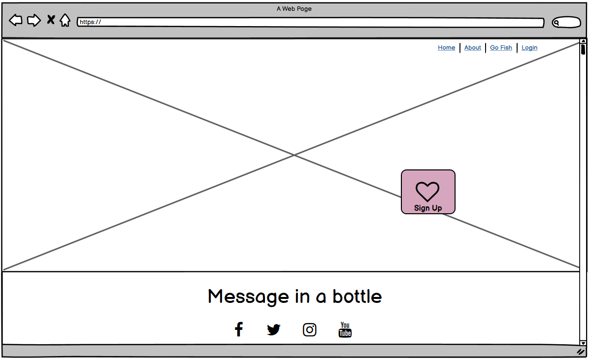
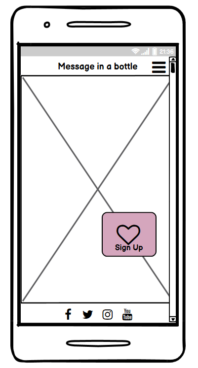
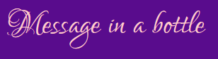
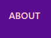
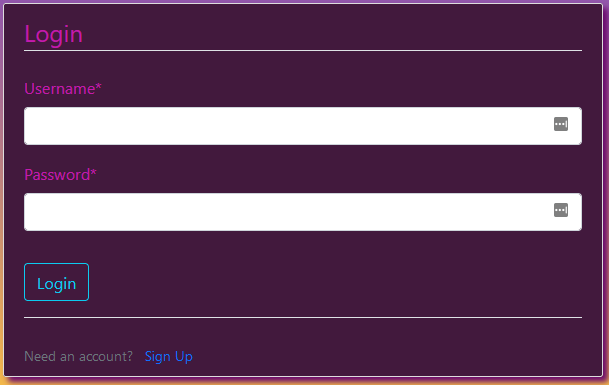
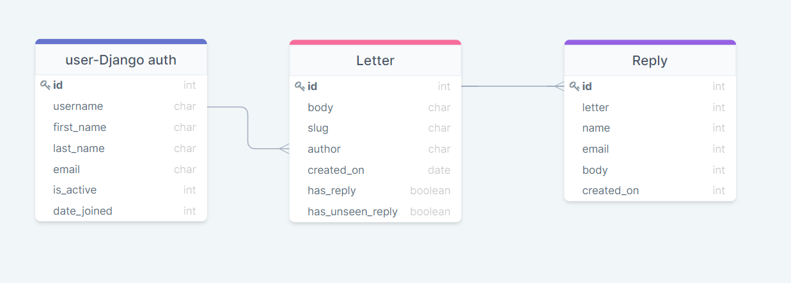
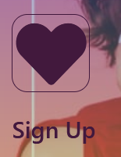

# Overview
This project is a conjunct effort of [Amir Rastkhadiv](https://github.com/Amir-Rastkhadiv), [Chris Carabine](https://github.com/ccarabine),[Cian O'Connor](https://github.com/AlexNexton), [Daniel Callaghan](https://github.com/xiaoniuniu89), [Monique Veldman](https://github.com/Seamse) and [Rodolfo Frainer](https://github.com/nellymaw).

February's code institute's Hackaton is Valentines, our group decided that our main goal is to keep the dating scene light-hearted, helping users to connect with one another using only half sentences, this way the user doesn't have to overthink as it is very limiting and can be answered in a short amount of time.

# Table of contents
- [Overview](#overview)
- [Table of contents](#table-of-contents)
- [About](#about)
- [UX Design](#ux-design)
  - [Project Goals](#project-goals)
  - [User Stories](#user-stories)
  - [Typography](#typography)
  - [Colors](#colors)
  - [Wireframes](#wireframes)
  - [Landing Page](#landing-page)
  - [Mobile Landing Page](#mobile-landing-page)
- [Features](#features)
  - [Nav Bar](#nav-bar)
  - [Landing Page](#landing-page-1)
  - [Login Page](#login-page)
  - [Features left to impliment](#features-left-to-impliment)
- [Technologies Used](#technologies-used)
  - [Languages Used](#languages-used)
  - [Frameworks, Libraries & Programs Used](#frameworks-libraries--programs-used)
  - [Dev Tools](#dev-tools)
  - [Database](#database)
    - [Database Schema](#database-schema)
- [Testing](#testing)
  - [Validation Results](#validation-results)
  - [Test Cases](#test-cases)
- [Deployment](#deployment)
  - [GitHub Pages](#github-pages)
  - [Forking the GitHub Repository](#forking-the-github-repository)
  - [Making a Local Clone](#making-a-local-clone)
  - [Gitpod](#gitpod)
- [Credits](#credits)

# About
Message in a bottle is an ocean of potential where you can meet kindred spirits or fish for that special someone!
Add your own bottled messages to our vast ocean or fish to your heart's content for other people's messages.
Sign up today!
- Sign up and create a profile with us
- Fish for bottles in the ocean
- Respond to messages that appeal to you
- If the recipient likes your reply they can now contact you directly
- Write secret half messages for your own bottles
- Add them to our ocean and see who replies to and finishes your message
- A received reply offers you the option to contact them directly

# UX Design

## Project Goals
To create a light and engaging space where people can communicate with other people with anonymity until they decide that someone is compatible with them.
- Keep the website light and engaging.
- Get the user possibly connected with someone that he/she has something in common.
- Allowing the user choose if he will share his personal information to anyone

## User Stories
- As a user I would like to be able to access the about section of the page to understand it's purpose and how to interact with it.

- As a user I would like to be able to create an account.

- As a user I would like to be able to login into the account I've previously created.

- As a user I would like to be able to change my account's password.

- As a user I would like to be able to create my own bottled messages so other people can interact with.

- As a user I would like to be able to respond or not to a bottle that I have picked up.

- As a user I would like to be able to access my inbox so that i can read sent and received messages.

- As a user I would like the messages in my inbox to be refreshed periodically.

- As a user I would like to be able to contact other users who have replied to my bottles via a contact form.

## Typography
- [Lato](https://fonts.google.com/specimen/Lato?query=lato&preview.text=Love%20is%20in%20the%20air&preview.text_type=custom#standard-styles) and [Lovers Quarrel](https://fonts.google.com/specimen/Lovers+Quarrel?query=love&preview.text=Love%20is%20in%20the%20air&preview.text_type=custom) fonts were used.

## Colors
 `#590c8d`

 `#FFCCCC`

 `#42193D`

 `#C31AAD`

 `#FFFFFF`

## Wireframes
## Landing Page


## Mobile Landing Page


# Features
## Nav Bar
- Home button<br>
- About button<br> 
- Login button<br> 

## Landing Page
- Sign up button<br> <br>
- Social Media buttons<br> 

## Login Page
- Login page<br> 

## Features left to impliment


# Technologies Used 
## Languages Used
- [HTML](https://developer.mozilla.org/en-US/docs/Web/HTML) 
- [CSS](https://developer.mozilla.org/en-US/docs/Web/CSS) 
- [JavaScript](https://developer.mozilla.org/en-US/docs/Web/JavaScript) 
- [Jquery](https://jquery.com/) 
- [Python](https://www.python.org/) 

## Frameworks, Libraries & Programs Used
- [Django:](https://www.djangoproject.com/) Django is the framework used through the project.
- [Gitpod:](https://www.gitpod.io) 
   Gitpod was used as an IDE for most of the participants.
- [Github:](https://www.github.com)
   GitHub is used to store the projects code after being pushed from [Git](https://git-scm.com/).
- [Font Awesome:](https://fontawesome.com/)
    Font Awesome was used on all pages throughout the website to add icons for aesthetic and UX purposes.
- [Google Fonts:](https://fonts.google.com/)
    Google fonts were used to import the 'Lato' font into the style.css file which is used on all pages throughout the project.
- [Balsamiq:](https://https://balsamiq.com/)
    Balsamiq was used to create the wireframes used on this project.
- [AmIResponsive:](http://ami.responsivedesign.is/)
    Was used to check the website's responsiveness on common resolutions.

## Dev Tools
[Chrome Dev Tools](https://developer.chrome.com/docs/devtools/) & [Firefox Developer Tools](https://developer.mozilla.org/en-US/docs/Tools)

## Database
A relational database was used for this project. During development SQLite DB was used and for production Postgres was used as the main database, and for deployment all data was migrated to Heroku Postgres.
### Database Schema


# Testing 

## Validation Results
HTML

[W3C validator](MISSING-URL)

CSS

[(Jigsaw) validator](MISSING-URL)

JSHint

[JSHint](https://jshint.com/) test completed with no error or warnings.

Lighthouse

Result for Desktop 


Result for Mobile


## Test Cases
- To access the about section of the page:
  
  On the right corner of the nav bar you will find the About button<br>
  

  Once clicked it will open a modal window<br>
  


- To create an account:<br>
First press the sign up button<br>
<br>
Once in the Sign up page fill the boxes and press sign up.<br>


- To login on a previously created account:<br>
Press the login button found on the right of the navbar<br>
<br>
Fill the field boxes up then press the login button

- To change an account's password:

- To create bottled messages:

- To pick a bottled message from someone:
  Once logged in Press the "GO FISH" button located on the navbar
  
  In a few seconds the page will start to be populated with bottles. Just click on whichever one you want to pick up.

- To respond or not to a picked up bottle:
  Once the user pick a bottle up hes met with two choices:
  
  Press "reply" to reply the message or press "Throw back" to not reply to the message

- To access the user's inbox:

- To check if the inbox was refreshed automatically:

- To view the profile of an user that has replied to one of the messages written by the user:

- To contact another user via the contact form provided.

# Deployment

## GitHub Pages

The project was deployed to GitHub Pages using the following steps...

1. Log in to GitHub and locate the [GitHub Repository](!!!CHANGE-THIS!!!)
2. At the top of the Repository (not top of page), locate the "Settings" Button on the menu.
3. Scroll down the Settings page until you locate the "GitHub Pages" Section.
4. Under "Source", click the dropdown called "None" and select "Master Branch".
5. The page will automatically refresh.
6. Scroll back down through the page to locate the now published site [link](!!!CHANGE-THIS!!!) in the "GitHub Pages" section.

## Forking the GitHub Repository

By forking the GitHub Repository we make a copy of the original repository on our GitHub account to view and/or make changes without affecting the original repository by using the following steps...

1. Log in to GitHub and locate the [GitHub Repository](!!!CHANGE-THIS!!!)
2. At the top of the Repository (not top of page) just above the "Settings" Button on the menu, locate the "Fork" Button.
3. You should now have a copy of the original repository in your GitHub account.

## Making a Local Clone

1. Log in to GitHub and locate the [GitHub Repository](!!!CHANGE-THIS!!!)
2. Under the repository name, click "Clone or download".
3. To clone the repository using HTTPS, under "Clone with HTTPS", copy the link.
4. Open Git Bash
5. Change the current working directory to the location where you want the cloned directory to be made.
6. Type `git clone`, and then paste the URL you copied in Step 3.

```
$ git clone https://github.com/YOUR-USERNAME/YOUR-REPOSITORY
```

7. Press Enter. Your local clone will be created.

```
$ git clone https://github.com/YOUR-USERNAME/YOUR-REPOSITORY
> Cloning into `CI-Clone`...
> remote: Counting objects: 10, done.
> remote: Compressing objects: 100% (8/8), done.
> remove: Total 10 (delta 1), reused 10 (delta 1)
> Unpacking objects: 100% (10/10), done.
```
## Gitpod

1. Install the gitpod browser extension. [Gitpod Browser Extension](https://www.gitpod.io/docs/browser-extension/)
2. Go to the project repository. [Here](!!!CHANGE-THIS!!!)
3. Click the gitpod button beside the about section.  


# Credits

- [w3schools](https://www.w3schools.com/howto/howto_css_modals.asp)
- Images were taken from [Pexels.com](https://www.pexels.com)